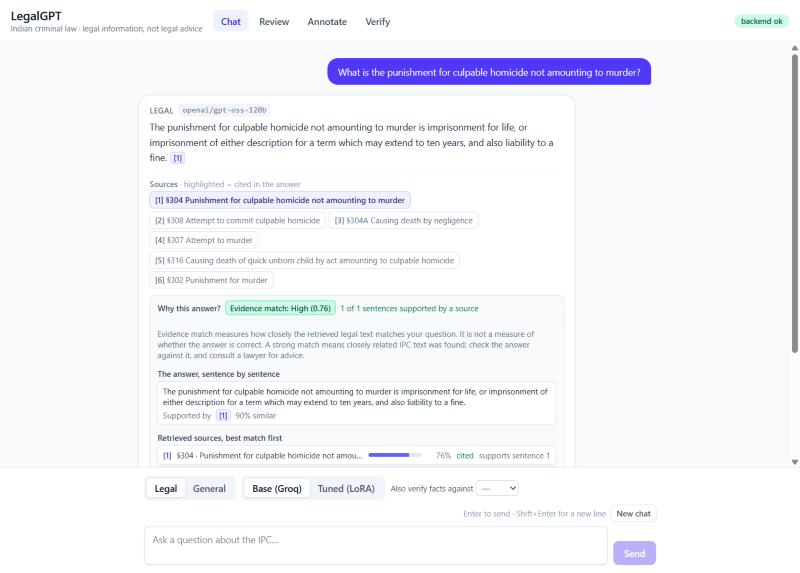
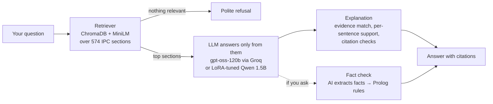

# LegalGPT

**Ask questions about the Indian Penal Code and get answers grounded in the text of the law.**
Every answer cites the sections it used, explains how well they matched your question, and can
check the facts you describe against the legal elements of an offence.

[](https://github.com/bhxvish/legalgpt/actions/workflows/ci.yml)

> ⚖️ **Legal information, not legal advice.** LegalGPT covers the Indian Penal Code, 1860 only.
> The IPC was replaced by the Bharatiya Nyaya Sanhita (BNS) for offences from 1 July 2024.



---

## What it does

| | Feature | In plain words |
|---|---|---|
| 💬 | **Grounded answers** | Finds the relevant IPC sections, answers only from them, and cites each one as `[1]`, `[2]`… Click a citation to read the section. If nothing in the IPC matches, it says so instead of guessing. |
| 🔍 | **"Why this answer?"** | Shows how closely the retrieved law matched your question, which source supports each sentence of the answer, and warns about anything unsupported. |
| ✅ | **Fact check with rules** | Describe a case and pick a section (e.g. 304A). An AI pulls out the facts, each with a quote from your text, and a Prolog rule engine checks them against the section's elements: *consistent*, *inconsistent* or *insufficient facts*. |
| 🏷️ | **Faster dataset building** | An InLegalBERT model suggests the role of every sentence in a judgment (Facts, Argument, Ruling…). People check only the uncertain ones plus random spot checks. |
| 🧪 | **Fine-tuned model comparison** | Switch between a hosted model and a small model fine-tuned on our data (LoRA) to compare their answers side by side. |

## How it works



The research side feeds the app:
**judgments → sentence roles (manual + InLegalBERT-assisted, human-reviewed) → versioned dataset
→ LoRA fine-tuning.**

## Try it

You need [Docker Desktop](https://www.docker.com/products/docker-desktop/) and a free
[Groq API key](https://console.groq.com/keys).

```bash
git clone https://github.com/bhxvish/legalgpt.git
cd legalgpt
cp .env.example .env        # then open .env and paste your key after GROQ_API_KEY=
docker compose up --build
```

Open **http://localhost:5173**. The first build takes about 10 minutes. On first start the backend
also builds its search index from the IPC text in this repo (about a minute; the log says
`index ready: 685 chunks`).

**What works out of the box:** Chat (Legal and General modes), citations, the Why panel, fact
checking and the Verify tab. The annotation data and trained models are not in this repository,
so the **Review** and **Annotate** tabs start empty and the **Tuned (LoRA)** model is disabled until
you train one (see the [full guide](docs/GUIDE.md)).

Try asking:
- *What is the punishment for causing death by negligence?*
- *What is the difference between culpable homicide and murder?*
- *A lorry driver overtook rashly and killed a motorcyclist. Which section applies?* (then pick
  *Also verify facts against → s.304A*)

## The tabs

| Tab | Who it's for | What you do there |
|---|---|---|
| **Chat** | Everyone | Ask questions. *Legal* mode answers only from the IPC with citations; *General* mode is an ordinary chatbot answer. |
| **Review** | Annotators | Check the computer's suggested sentence roles. Only uncertain sentences and a random sample of confident ones need you. Press Enter to accept or 1–5 to change, then *Sign off*. |
| **Annotate** | Annotators | Label a judgment fully by hand: cases the Review step sent back, and a small "gold" sample used to keep measuring the model. |
| **Verify** | Everyone | Paste case facts and check them against one of 7 encoded sections (279, 304A, 304B, 323, 337, 338, 379). |

## Results

All numbers are measured on held-out data; the details are in [PLANNING.md](PLANNING.md).

| Part | Result |
|---|---|
| **Retrieval** | All 574 sections of the India Code IPC parsed into 685 chunks. The refusal threshold (0.55 cosine similarity) was calibrated on in-scope vs out-of-scope questions. |
| **Sentence-role classifier** (InLegalBERT) | Accuracy **78%**, macro-F1 **0.74 ± 0.04** (5-fold cross-validation over 31 annotated judgments, up from 71% and 0.66 after adding sentence context). At the default confidence bar, **19%** of sentences need a human check (was 44%). |
| **LoRA fine-tuning** (Qwen2.5-1.5B, 4-bit) | Learned the required citation format (5 of 6 answers vs 0 of 6 for the untuned model) but copies sources and refuses too often. Useful as a study, not a replacement for the hosted model. |
| **Fact verification** | 7 IPC sections encoded as element checklists in Prolog; each extracted fact must quote the user's text, and extraction runs twice to keep only stable answers. |

## Run without Docker

You need Python 3.11, Node.js 20+ and [SWI-Prolog](https://www.swi-prolog.org/download/stable)
(for fact checking).

```bash
python -m venv .venv
.venv/Scripts/pip install -r backend/requirements.txt      # Windows (macOS/Linux: .venv/bin/pip)
.venv/Scripts/python -m uvicorn app.main:app --app-dir backend --port 8000
```

In a second terminal:

```bash
npm --prefix frontend install
npm --prefix frontend run dev
```

**Tests:** `pytest -m "not integration"` (the same command CI runs; no network or API key needed).
**Demo:** with the app running, `python backend/scripts/demo.py` sends five questions through the
whole pipeline and prints a summary.

## Project layout

```text
backend/app/core/                 retrieval, prompts, chat API, LLM clients
backend/app/annotation/           judgment collection, sentence splitting, label scheme, annotation store
backend/app/labeling_assistant/   InLegalBERT classifier, review queue
backend/app/finetuning/           LoRA training data, trainer, model comparison
backend/app/explainability/       evidence match, citation checks, sentence attribution
backend/app/verification/         fact extraction + Prolog rules (rules/*.pl)
backend/scripts/                  command-line tools (ingest, train, review, demo…)
frontend/                         React + Tailwind web app
data/corpus/ipc_chunks.jsonl      the parsed IPC (public domain)
docs/                             full guide, annotation guideline, reports
```

## Limitations

- **IPC only**, and only the bare act: no case law, no CrPC or Evidence Act. Offences after 1 July
  2024 fall under the BNS, which is not covered.
- **"Evidence match" is not correctness.** It says how well the retrieved law matches the question,
  not whether the answer is right.
- **Small dataset:** 31 hand-labelled judgments plus one assisted case; agreement between
  annotators has not been measured yet.
- **The fact check is only as good as the extracted facts**, and covers 7 sections without
  exceptions or general defences.
- **No login or rate limiting:** run it locally or behind your own access control.

The full list is in [PLANNING.md → Known limitations](PLANNING.md#known-limitations).

## Future work

- **BNS coverage**, with a mapping from IPC to BNS sections; judgments as a second source.
- **More Prolog sections**, including exceptions and general defences.
- **Double annotation** to measure inter-annotator agreement; human-written answers for LoRA training.
- **ZKML (zero-knowledge proofs of model inference): deliberately not implemented.** Proving a
  transformer's forward pass in zero knowledge is still orders of magnitude too slow for a 1.5B+
  model on this hardware, and it would prove *which model ran*, not that the legal answer is right.

## Documentation

- [Full guide](docs/GUIDE.md): every module, script, setting and API endpoint
- [PLANNING.md](PLANNING.md): design decisions, measured results and known limitations, phase by phase
- [Annotation guideline](docs/annotation_guideline.md): how to label sentence roles
- [LoRA comparison report](docs/reports/lora_v0.2_comparison.md)

## Acknowledgements

- [law-ai/InLegalBERT](https://huggingface.co/law-ai/InLegalBERT) for the legal-domain BERT model
- [Qwen2.5-1.5B-Instruct](https://huggingface.co/Qwen/Qwen2.5-1.5B-Instruct) and
  [gpt-oss-120b](https://huggingface.co/openai/gpt-oss-120b) (served by [Groq](https://groq.com))
- [all-MiniLM-L6-v2](https://huggingface.co/sentence-transformers/all-MiniLM-L6-v2) for embeddings
- [India Code](https://www.indiacode.nic.in/) for the bare act text
- Supreme Court judgments from the CC-BY-4.0 dataset
  [labofsahil/Indian-Supreme-Court-Judgments](https://huggingface.co/datasets/labofsahil/Indian-Supreme-Court-Judgments)
